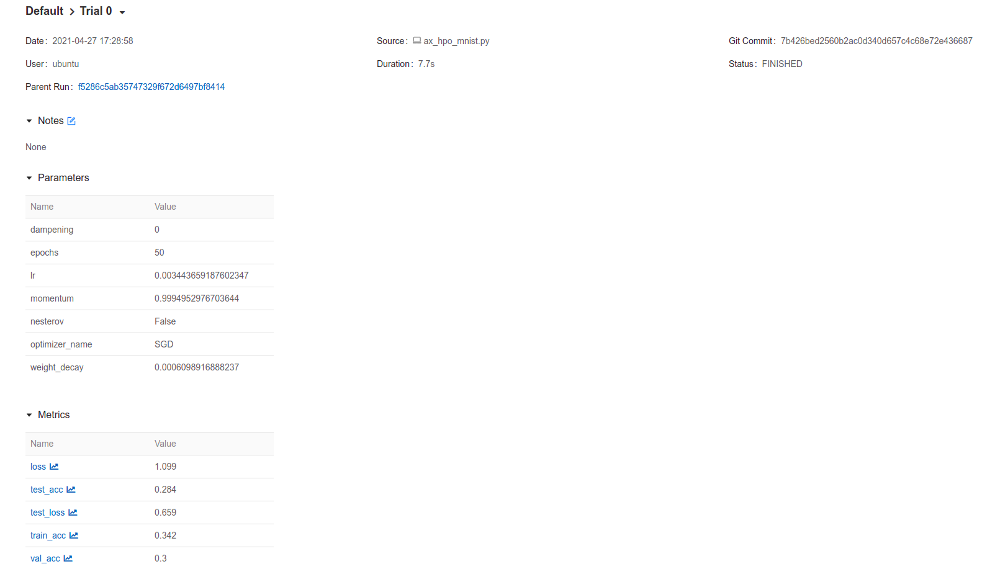
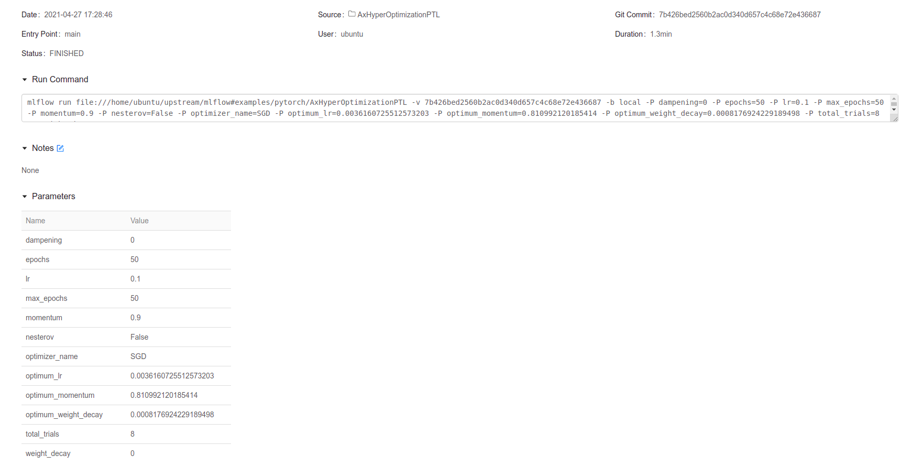

## Ax Hyperparameter Optimization Example 
In this example, we train a Pytorch Lightning model to classify Iris flower classification dataset.
A parent run will be created during the training process,which would dump the baseline model and relevant parameters,metrics and model along with its summary,subsequently followed by a set of nested child runs, which will dump the trial results.
The best parameters would be dumped into the parent run once the experiments are completed.

### Running the code
To run the example via MLflow, navigate to the `mlflow/examples/pytorch/AxHyperOptimizationPTL` directory and run the command

```
mlflow run .
```

This will run `AxHyperOptimizationPTL.py` with the default set of parameters such as `max_epochs=3` and `total_trials=3`. You can see the default value in the `MLproject` file.

In order to run the file with custom parameters, run the command

```
mlflow run . -P max_epochs=X -P total_trials=Y
```

where `X` is your desired value for `max_epochs` and `Y` is your desired value for `total_trials`.

If you have the required modules for the file and would like to skip the creation of a conda environment, add the argument `--no-conda`.

```
mlflow run . --no-conda
```

### Viewing results in the MLflow UI

Once the code is finished executing, you can view the run's metrics, parameters, and details by running the command

```
mlflow ui
```

and navigating to [http://localhost:5000](http://localhost:5000).

For more details on MLflow tracking, see [the docs](https://www.mlflow.org/docs/latest/tracking.html#mlflow-tracking).

### Passing custom training parameters

The parameters can be overridden via the command line:

1. max_epochs - Number of epochs to train model. Training can be interrupted early via Ctrl+C
2. total_trials - Number of experimental trials


For example:
```
mlflow run . -P max_epochs=3 -P total_trials=3
```
Or to run the training script directly with custom parameters:

```
python ax_hpo_iris.py --max_epochs 3 --total_trials 3
```

By running the above mentioned script, the hyperparameters are logged into MLFLow as nested runs.


The child run contains the details of the hyperparameters used during that particular trial.



And the parent run contains the details of the optimum parameters derived by running n trials.



## Logging to a custom tracking server
To configure MLflow to log to a custom (non-default) tracking location, set the `MLFLOW_TRACKING_URI` environment variable, e.g. via `export MLFLOW_TRACKING_URI=http://localhost:5000`. For more details, see [the docs](https://mlflow.org/docs/latest/tracking.html#where-runs-are-recorded).
